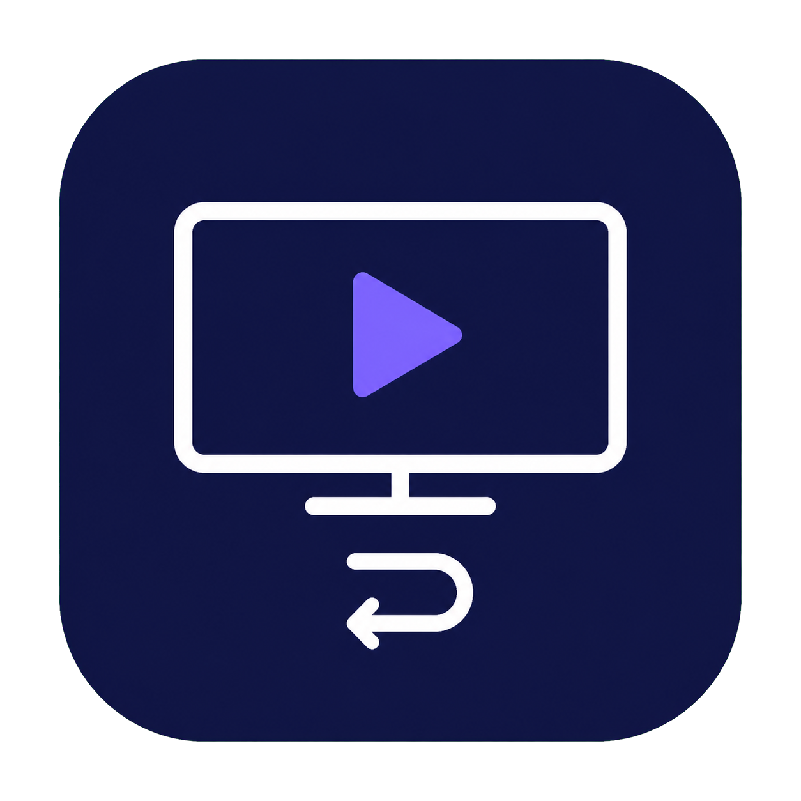
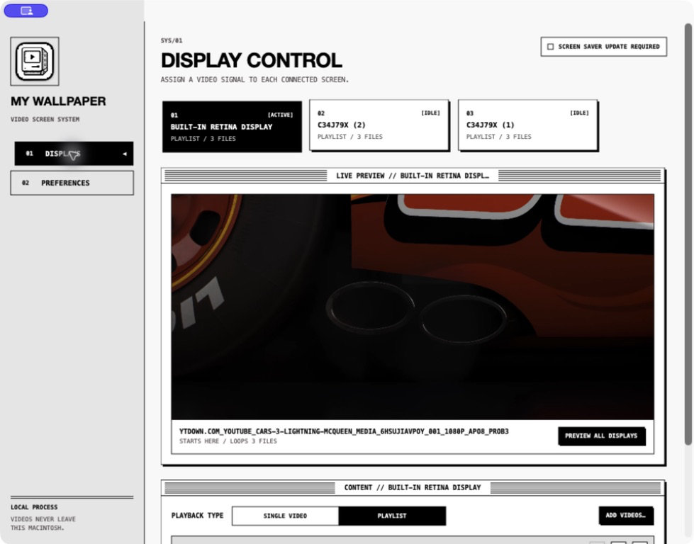
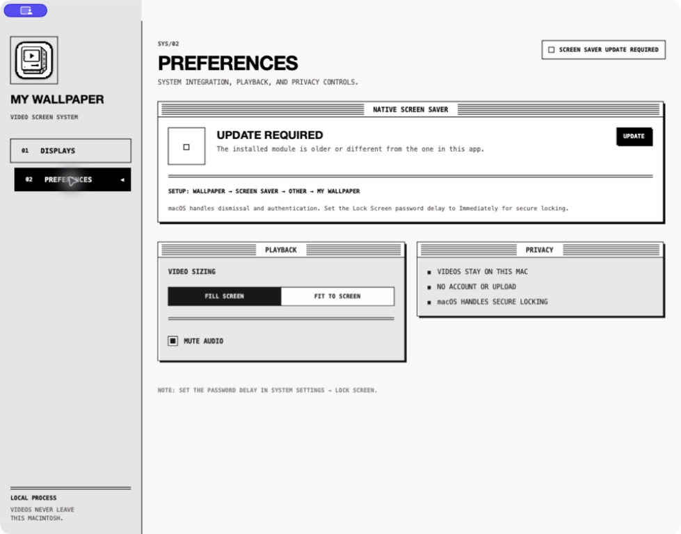

# My Wallpaper



My Wallpaper is a native macOS app for assigning your own videos to each display. Each display can use one video or an ordered playlist, with a chosen starting video and continuous looping.

The interface follows a classic System 1984 visual language: monochrome controls, pixel-sharp borders, striped window bars, inverse selections, and the custom compact-Mac video icon.

## Prototype status

This repository contains a working prototype. GitHub Actions produces an ad-hoc-signed app by default, so macOS may require **Control-click → Open** the first time. For public distribution, configure the optional Developer ID and notarization secrets documented below; without them, the app is not notarized by Apple.

## New here?

If you have just cloned the repository, start with the [first-time setup guide](docs/FIRST-TIME-SETUP.md). It walks through installing Xcode, building the app, opening it, and resolving the most common first-run issues.

## What it does

- Assigns a different video or playlist to every connected display.
- Lets each playlist start at a selected item and continue in order forever.
- Imports MOV, MP4, and M4V files into `~/Library/Application Support/My Wallpaper/Videos`.
- Keeps video files and settings on this Mac; nothing is uploaded.
- Provides a menu-bar icon for starting the native My Wallpaper screen saver or putting the display to sleep.
- Includes a universal `arm64`/`x86_64` `.saver` module for macOS's automatic screen-saver system.

## Install the app

1. Open the release folder and locate **My Wallpaper.app**.
2. Drag **My Wallpaper.app** into Finder's **Applications** folder.
3. Open it from **Applications**. If macOS shows a security warning for this local prototype, Control-click the app, choose **Open**, and confirm.

The packaged app is created at `dist/My Wallpaper.app` when you build it locally. The installed copy should be `/Applications/My Wallpaper.app`.

For a drag-to-Applications installer, download **My-Wallpaper.dmg** from the GitHub Actions artifact or a tagged GitHub Release. Open the DMG, then drag **My Wallpaper.app** onto the **Applications** shortcut shown beside it.

## Configure displays

1. Open **My Wallpaper** and select a display card.
2. Choose **Single video** and add one video, or choose **Playlist** and add multiple videos.
3. Use **Start here** to choose which playlist item plays first.
4. Reorder videos with **Go Up** and **Go Down**. The playlist loops continuously.
5. Use **Preview all displays** to verify the videos and scaling. Preview is non-locking and ends automatically after 45 seconds.



## Menu-bar screen saver and lock

My Wallpaper adds a transparent monochrome version of its classic Mac icon to the macOS menu bar while the app is running. Complete the native setup in **Preferences** before starting the saver:

- Install or update the bundled screen saver module.
- Click **Verify System Setup** and allow the one-time Automation request. My Wallpaper uses this only to confirm which saver macOS selected, preventing the app from accidentally starting a different saver.
- Open System Settings and select **Wallpaper → Screen Saver → Other → My Wallpaper**.

The menu actions are:

- **Start Screen Saver**: launches macOS ScreenSaverEngine. Manual and automatic idle activation therefore use the same native module, display assignments, playlist ordering, and starting videos.
- **Finish Screen Saver Setup…**: appears until the installed module is current, selection verification succeeds, and My Wallpaper is selected.
- **Lock Mac Now**: asks macOS to put the display to sleep. Authentication still follows the Mac's Lock Screen policy.
- **Open My Wallpaper**: brings the configuration window back after it is closed.
- **Screen Saver Settings…**: opens the relevant macOS settings pane.

ScreenSaverEngine—not My Wallpaper's app window—handles input dismissal and authentication. Set **System Settings → Lock Screen → Require password after screen saver begins or display is turned off** to **Immediately** for secure locking. Accessibility permission is not used and can be removed if it was granted to an earlier build.

The menu-bar icon is available while My Wallpaper is running, even if its main window is closed. Quit the app to remove the icon.

## Native screen saver setup

Manual menu activation and automatic idle activation both require the native `.saver`:

1. Open **Preferences** in My Wallpaper.
2. Click **Install** or **Update**.
3. Click **Verify System Setup**, then allow My Wallpaper to control System Events when macOS asks. If previously denied, enable it under **System Settings → Privacy & Security → Automation**.
4. Click **Open System Settings** and select **Wallpaper → Screen Saver → Other → My Wallpaper**.
5. Return to My Wallpaper and confirm the status reads **My Wallpaper Selected**.
6. In **System Settings → Lock Screen**, configure the password delay and idle activation time.

My Wallpaper never changes Apple's selected saver automatically. It verifies the live selection through macOS Automation and fails closed if it cannot confirm that My Wallpaper is selected.

The app writes a versioned native playback manifest in Application Support. Configuration changes apply the next time the native saver starts. A newly connected or unconfigured display uses the first playable configured playlist until it receives its own assignment. If no playable videos remain anywhere, manual start is blocked and automatic activation displays a stable black screen rather than crashing.

**Preview All Displays** is separate from the real saver: it uses temporary app-owned windows, does not lock, keeps the displays awake only during the preview, and exits after 45 seconds or on input.



## Build locally

Requires macOS 14 or newer. Building needs Apple's command-line developer tools; running the XCTest suite requires a full Xcode installation because XCTest is not included in the standalone command-line tools. For a complete first-clone walkthrough, including selecting Xcode as the active developer directory, see the [first-time setup guide](docs/FIRST-TIME-SETUP.md).

```sh
./scripts/package-app.sh release
open "dist/My Wallpaper.app"
```

For a debug build:

```sh
./scripts/package-app.sh debug
open "dist/My Wallpaper.app"
```

The packaging script selects an installed macOS SDK automatically. Set `MY_WALLPAPER_SDK` to override the SDK path.

To build only the screen-saver bundle:

```sh
./scripts/build-saver.sh
```

The bundle is written under `.build/screensaver/release/My Wallpaper.saver`.

To regenerate the app icon assets from the tracked source artwork:

```sh
./scripts/build-icon.sh
```

To create the installer DMG locally after building:

```sh
./scripts/create-dmg.sh
```

The result is `dist/My-Wallpaper.dmg`.

GitHub Actions runs tests and the release build on `macos-14` for pushes, pull requests, and manual runs. App and saver versions come from `support/version.env`, and a release tag must match that marketing version. Push `v0.3.0` to publish both `My-Wallpaper.dmg` and `My-Wallpaper.app.zip` to a GitHub Release:

```sh
git tag v0.3.0
git push origin v0.3.0
```

For signed distribution, add these repository secrets before pushing the tag:

- `MACOS_CERTIFICATE_BASE64`: base64-encoded Developer ID Application `.p12` certificate.
- `MACOS_CERTIFICATE_PASSWORD`: password for that certificate.
- `MACOS_KEYCHAIN_PASSWORD`: temporary CI keychain password.
- `MACOS_SIGNING_IDENTITY`: optional certificate name; defaults to `Developer ID Application`.
- `APPLE_ID`, `APPLE_TEAM_ID`, and `APPLE_APP_PASSWORD`: Apple notarization credentials.

When these secrets are present, the workflow signs and notarizes/staples both the app and final DMG. Keep these values only in GitHub Actions secrets, never in the repository.

## Data and privacy

Imported videos are copied into the app's Application Support directory. Settings are stored in `~/Library/Application Support/My Wallpaper/settings.json`, the native module reads `screensaver-manifest-v1.json`, and the app also keeps its local preferences. The app does not require an account or network connection. Automation access is used only for the read-only selected-saver verification described above.
